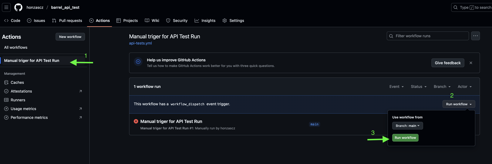

# API Tests for Barrel Monitor
This project tests basic API of the barrel lifecycle and its associated measurements.  
The target API is accessible at: [https://to-barrel-monitor.azurewebsites.net/swagger/index.html](https://to-barrel-monitor.azurewebsites.net/swagger/index.html)
## Dependency Installation

```bash
pip install -r requirements.txt
```

## Environment Setup

To change the target API URL, edit the value in:

```
configurations.py

TESTENV_URL = "https://to-barrel-monitor.azurewebsites.net"
```

## Running Tests

### Standard execution

```bash
pytest -v
```

### Parallel execution (e.g. 4 parallel workers)

Tests are independent and safe to run in parallel.

```bash
pip install pytest-xdist
pytest -n 4
```

### Directly in GitHub Action

You can run the tests directly from [GitHub Actions](https://github.com/honzascz/barrel_api_test/actions) by clicking **"Run workflow"**:

 
